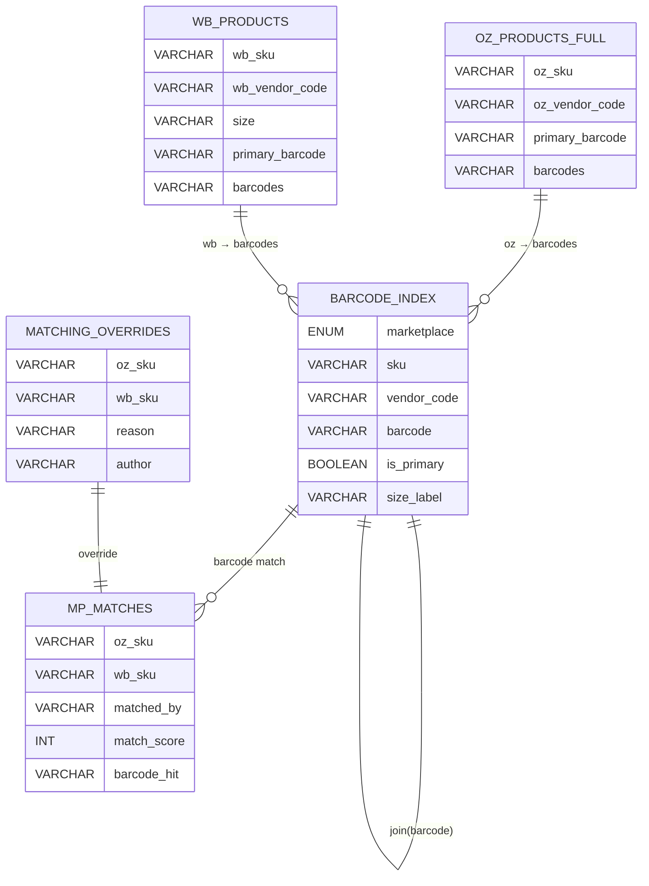

# ТЗ: Модуль сопоставления карточек Ozon ↔ Wildberries по штрихкодам

Документ описывает бизнес‑процессы, правила и схемы для разработки бэкенд‑модуля, который находит соответствия между карточками маркетплейсов Ozon и Wildberries. Основной принцип — поиск по штрихкодам (barcodes) с приоритетом на «актуальный» `primary_barcode` и использованием полного списка штрихкодов каждой карточки. Цель — реализовать функциональность поиска соответствий; любые служебные таблицы (индексы) являются техническими деталями, а не самоцелью.

## 1. Контекст и ключевые проблемы

1) Разная семантика «артикулов продавца»:
- Ozon: «1 уникальный `oz_vendor_code` = 1 размер».
- Wildberries: «1 уникальный `wb_vendor_code` = множество размеров».
- Следствие: общие названия/атрибуты для прямой стыковки невозможны; `oz_vendor_code` и `wb_vendor_code` не совпадают по смыслу.

2) Отсутствие полей с мэппингом 1→1:
- Нет единого поля, которое пересекается 1 к 1 между маркетплейсами.
- Даже 
  - `oz_sku` ↔ `wb_sku`
  - `oz_vendor_code` ↔ `wb_vendor_code`
  не могут быть использованы как универсальные ключи соответствия.

Принятое решение: сопоставление по штрихкодам, так как любой штрихкод уникален внутри своей таблицы и кодирует конкретный размер.

## 2. Термины и сущности

- Карточка товара — строка в источнике маркетплейса (размер‑SKU).
- `barcodes` — список всех штрихкодов, принадлежащих карточке (разделитель `;`).
- `primary_barcode` — «актуальный» штрихкод карточки, задействуется первым при сопоставлении.
- `oz_products_full` — таблица Ozon со столбцами `oz_sku`, `oz_vendor_code`, `barcodes`, `primary_barcode`, …
- `wb_products` — таблица Wildberries со столбцами `wb_sku`, `wb_vendor_code` (если присутствует), `size` (или аналог), `barcodes`, `primary_barcode`, …

Доменные допущения:
- Любой отдельный штрихкод уникален в пределах своей таблицы (внутри Ozon, внутри WB).
- Списки штрихкодов между маркетплейсами пересекаются не на 100% (исторические партии, дубли карточек, ручные ошибки, несвоевременная загрузка кодов и т. д.).
- Если штрихкод соответствует размеру «29» на Ozon, то при корректной настройке карточек он будет соответствовать размеру «29» и на WB.
 - Допустимы ситуации many‑to‑many: `1 wb_sku ↔ 1..N oz_sku` и `1 oz_sku ↔ 1..N wb_sku`. На Ozon каждый `oz_sku` — отдельный размер; на WB один `wb_sku` может встречаться по нескольку раз с разными `size` (уникальность по паре `wb_sku + size`).

## 3. Источники данных и поля

- Ozon: `oz_products_full`:
  - ключевые: `oz_sku`, `oz_vendor_code`, `primary_barcode`, `barcodes`
  - доп.: статусы (`is_active`/`archived`), атрибуты размеров, даты обновления и т. п. (если доступны)

- Wildberries: `wb_products`:
  - ключевые: `wb_sku`, `wb_vendor_code` (если есть), `size` (если есть), `primary_barcode`, `barcodes`
  - доп.: статусы, размеры, даты обновления и т. п. (если доступны)

## 4. Нормализация и индексация штрихкодов

Назначение — подготовить данные для быстрого поиска соответствий. Плоская таблица «штрихкод → карточка МП» используется как технический индекс, а не как конечная цель системы.

Правила нормализации:
- Трим пробелы, нормализуй регистр (штрихкоды — числовые/алфанумерик, регистр обычно неважен).
- Сохраняй ведущие нули (важно для EAN/UPC).
- Игнорируй пустые элементы после сплита.
- Удаляй дубль‑штрихкоды внутри одной карточки.

Индексация:
- Создать уникальный индекс по `(marketplace, barcode)` в нормализованной таблице, чтобы гарантировать уникальность и ускорить поиск.

## 5. Технические структуры (опционально)

1) `barcode_index` — нормализованный индекс штрихкодов.

Пример полей:
- `marketplace` ENUM('oz','wb')
- `sku` VARCHAR — `oz_sku` или `wb_sku`
- `vendor_code` VARCHAR — `oz_vendor_code` или `wb_vendor_code`
- `barcode` VARCHAR — один штрихкод (одна строка = один штрихкод)
- `is_primary` BOOLEAN — признак, что это `primary_barcode`
- `size_label` VARCHAR — ярлык размера (если есть в источнике)
- `updated_at` TIMESTAMP

Уникальные ключи/индексы:
- UNIQUE (`marketplace`, `barcode`)
- INDEX (`marketplace`, `sku`)

2) `mp_matches` — результат сопоставления Ozon ↔ Wildberries (многие‑ко‑многим допускаются).

Пример полей:
- `oz_sku` VARCHAR
- `wb_sku` VARCHAR
- `matched_by` ENUM('primary↔primary','primary↔any','any↔primary','any↔any')
- `match_score` INTEGER — приоритет: primary‑primary = 100, primary‑any = 80, any‑primary = 80, any‑any = 60
- `barcode_hit` VARCHAR — какой штрихкод дал совпадение
- `confidence_note` VARCHAR — комментарий (например, «две активные карточки на WB»)
- `is_active_candidate` BOOLEAN — эвристика «какой кандидат активный»
- `created_at` TIMESTAMP

Ключи/ограничения:
- UNIQUE (`oz_sku`, `wb_sku`, `barcode_hit`)
- INDEX (`oz_sku`), INDEX (`wb_sku`)

3) `matching_overrides` — ручные фиксации соответствий (без обязательного UI; фиксация на уровне БД/скриптов).

Пример полей:
- `oz_sku` VARCHAR
- `wb_sku` VARCHAR
- `reason` VARCHAR — причина/комментарий
- `author` VARCHAR — кто подтвердил
- `created_at` TIMESTAMP

Эти фиксации имеют высший приоритет над автоматически рассчитанными соответствиями.

## 6. Алгоритм сопоставления

Базовая идея — идти от штрихкода к паре SKU.

Шаги (инкрементальная переиндексация):
1) Обновить `barcode_index` из `oz_products_full` и `wb_products`:
   - Распаковать `barcodes` по `;` в отдельные строки.
   - Добавить запись по `primary_barcode` (если его нет в списке — включить отдельно с `is_primary = true`).
   - Проставить `marketplace`, `sku`, `vendor_code`, `size_label` (если доступен), `updated_at`.
2) Построить соответствия `mp_matches` по пересечению баркодов:
   - Для каждого `barcode` найти `oz_sku` и `wb_sku` из `barcode_index`.
   - Если найдено `oz_sku` и `wb_sku` — записать в `mp_matches` с оценкой `match_score` согласно типу попадания (primary↔primary выше всего).
3) Агрегация кандидатов (many‑to‑many допустимы):
   - Для заданного `oz_sku` собрать все `wb_sku`, упорядочить по `match_score`, свежести данных и эвристикам активности.
   - Аналогично в обратную сторону (`wb_sku` → кандидаты `oz_sku`).
4) Учесть `matching_overrides` — возвращать их как «золотой» ответ, даже если авто‑алгоритм предлагает иное.

### 6.1. Поиск WB по OZ (примерный поток)

1) Найти карточку Ozon по `oz_sku`.
2) Взять `primary_barcode` и полный список `barcodes`.
3) По каждому штрихкоду поискать в `barcode_index` записи WB.
4) Сформировать кандидатов WB, отсортировать: primary‑primary → primary‑any → any‑primary → any‑any.
5) Отфильтровать архивные/неактуальные (если есть статусы). Возвращать множество кандидатов; выбор одного «топ‑кандидата» выполняет вызывающая сторона при необходимости.
6) Применить `matching_overrides` в конце как финальное правило.

### 6.2. Поиск OZ по WB

Поток симметричный: `wb_sku` → его штрихкоды → поиск в `barcode_index` (OZ) → ранжирование → фильтрация → overrides.

### 6.3. Оценка совпадений и работа с множественностью

Приоритеты (пример) для ранжирования кандидатов:
- `primary↔primary` = 100
- `primary↔any` или `any↔primary` = 80
- `any↔any` = 60

Доп. факторы для равных оценок:
- Флаг «актуальности» карточки (например, `is_active`, не `archived`).
- Наличие совпадения по размеру/варианту (если есть структура размеров).
- Свежесть обновления карточки.

Множественные соответствия — нормальная ситуация:
- `1 wb_sku ↔ N oz_sku`: отражает разные размеры на Ozon; возвращать все релевантные `oz_sku`.
- `1 oz_sku ↔ N wb_sku`: возможно при дублях/переизданиях карточек на WB; использовать `primary_barcode` и статусы для приоритезации «актуальных» WB, не скрывая альтернативы.

## 7. Бизнес‑процессы

Процесс «переиндексация и пересборка соответствий по событию обновления источников»:
- Триггеры: завершение загрузки/обновления таблиц `oz_products_full` и/или `wb_products`.
- Этапы: нормализация → обновление `barcode_index` → пересчёт `mp_matches`.
- Идемпотентность: повторная обработка одного и того же файла/набора строк не порождает дубли благодаря UNIQUE (`marketplace`, `barcode`).

Процесс «ручная фиксация соответствий»:
- Осуществляется на уровне БД/скриптов (без обязательного UI).
- Запись в `matching_overrides` имеет высший приоритет над автосопоставлением.

Онлайн‑поиск выполняется на бэкенде вызовом функций модуля либо через сервисный API.

## 8. API модуля (пакет `dataforge/`)

Расположение: `dataforge/matching.py` (или подмодуль `dataforge/matching/__init__.py`).

Публичные функции (сигнатуры):
```python
from typing import Iterable, List, Optional, TypedDict

class Match(TypedDict):
    oz_sku: Optional[str]
    wb_sku: Optional[str]
    barcode_hit: str
    matched_by: str  # 'primary↔primary' | 'primary↔any' | 'any↔primary' | 'any↔any'
    match_score: int
    confidence_note: Optional[str]

def find_wb_by_oz(oz_sku: str, limit: int = 5) -> List[Match]:
    """Возвращает кандидатов WB для заданного OZ SKU, отсортированных по score."""

def find_oz_by_wb(wb_sku: str, limit: int = 5) -> List[Match]:
    """Возвращает кандидатов OZ для заданного WB SKU, отсортированных по score."""

def find_by_barcodes(barcodes: Iterable[str], limit: int = 10) -> List[Match]:
    """Универсальный поиск по набору штрихкодов (любой стороны)."""

def rebuild_barcode_index() -> None:
    """Переиндексирует штрихкоды из источников в таблицу barcode_index."""

def rebuild_matches() -> None:
    """Пересчитывает mp_matches на основе barcode_index и правил оценивания."""
```

Ошибки/исключения:
- `ValueError` для пустых аргументов.
- Специфичные исключения для БД/хранилища (зависят от реализаций репозитория данных).

## 9. Примеры SQL/ETL (псевдокод)

Распаковка `barcodes` по `;` и заполнение `barcode_index`:

PostgreSQL:
```sql
-- Ozon → barcode_index
INSERT INTO barcode_index (marketplace, sku, vendor_code, barcode, is_primary, updated_at)
SELECT 'oz', p.oz_sku, p.oz_vendor_code, b AS barcode,
       (b = p.primary_barcode) AS is_primary, NOW()
FROM oz_products_full AS p,
     UNNEST(REGEXP_SPLIT_TO_ARRAY(COALESCE(p.barcodes, ''), ';')) AS b
WHERE NULLIF(TRIM(b), '') IS NOT NULL
ON CONFLICT (marketplace, barcode) DO UPDATE
SET sku = EXCLUDED.sku,
    vendor_code = EXCLUDED.vendor_code,
    is_primary = EXCLUDED.is_primary,
    updated_at = NOW();

-- Wildberries → barcode_index
INSERT INTO barcode_index (marketplace, sku, vendor_code, barcode, is_primary, updated_at)
SELECT 'wb', p.wb_sku, p.wb_vendor_code, b AS barcode,
       (b = p.primary_barcode) AS is_primary, NOW()
FROM wb_products AS p,
     UNNEST(REGEXP_SPLIT_TO_ARRAY(COALESCE(p.barcodes, ''), ';')) AS b
WHERE NULLIF(TRIM(b), '') IS NOT NULL
ON CONFLICT (marketplace, barcode) DO UPDATE
SET sku = EXCLUDED.sku,
    vendor_code = EXCLUDED.vendor_code,
    is_primary = EXCLUDED.is_primary,
    updated_at = NOW();
```

SQLite/DuckDB (варианты): использовать пользовательский сплит в ETL на Python и вставлять уже распакованные строки.

Построение `mp_matches` по пересечению штрихкодов:
```sql
INSERT INTO mp_matches (oz_sku, wb_sku, matched_by, match_score, barcode_hit, created_at)
SELECT oz.sku AS oz_sku,
       wb.sku AS wb_sku,
       CASE
         WHEN oz.is_primary AND wb.is_primary THEN 'primary↔primary'
         WHEN oz.is_primary AND NOT wb.is_primary THEN 'primary↔any'
         WHEN NOT oz.is_primary AND wb.is_primary THEN 'any↔primary'
         ELSE 'any↔any'
       END AS matched_by,
       CASE
         WHEN oz.is_primary AND wb.is_primary THEN 100
         WHEN oz.is_primary OR  wb.is_primary THEN 80
         ELSE 60
       END AS match_score,
       oz.barcode AS barcode_hit,
       NOW()
FROM barcode_index AS oz
JOIN barcode_index AS wb
  ON oz.barcode = wb.barcode
WHERE oz.marketplace = 'oz' AND wb.marketplace = 'wb'
ON CONFLICT (oz_sku, wb_sku, barcode_hit) DO NOTHING;
```

## 10. Тестирование (pytest)

Юнит‑тесты на модуль `dataforge/matching.py`:
- Сценарии:
  - Прямое совпадение `primary↔primary`.
  - Совпадение по вторичному штрихкоду (историческая партия).
  - Отсутствие совпадений.
  - Конфликт `1 oz_sku = 2 wb_sku`: выбирается активный WB.
  - Конфликт `1 wb_sku = 2 oz_sku`.
  - Применение `matching_overrides` поверх авто‑результатов.
- Фикстуры: мини‑набор таблиц `oz_products_full`, `wb_products` с разными комбинациями `barcodes`.

## 11. Метрики и мониторинг

- Покрытие штрихкодами: доля карточек с непустым `primary_barcode` и непустым списком `barcodes`.
- Доля карточек с найденным соответствием.
- Кол‑во конфликтов many‑to‑many.
- Среднее время отклика поиска по SKU.

## 12. Ограничения и риски

- Неполные списки баркодов в источниках → соответствие может не найтись без ручной фиксации.
- Человеческие ошибки при создании карточек (неверный размер у штрихкода) → ложные совпадения; снижать риски за счёт приоритетов `primary` и ручной валидации.
- Изменение штрихкодов в будущем (перевыпуск) → выполняется переиндексация; историю изменений хранить не требуется.

## 13. План внедрения

1) Реализовать `barcode_index` ETL и индексы.
2) Реализовать пересчёт `mp_matches` и базовое ранжирование.
3) Добавить `matching_overrides` и операции для фиксации на уровне БД/скриптов.
4) Написать юнит‑тесты на ключевые сценарии.
5) Интегрировать модуль в бэкенд (служебные функции/endpoint).

## 14. Визуальная схема (ERD)



---

Последнее обновление: автогенерация ассистентом.
